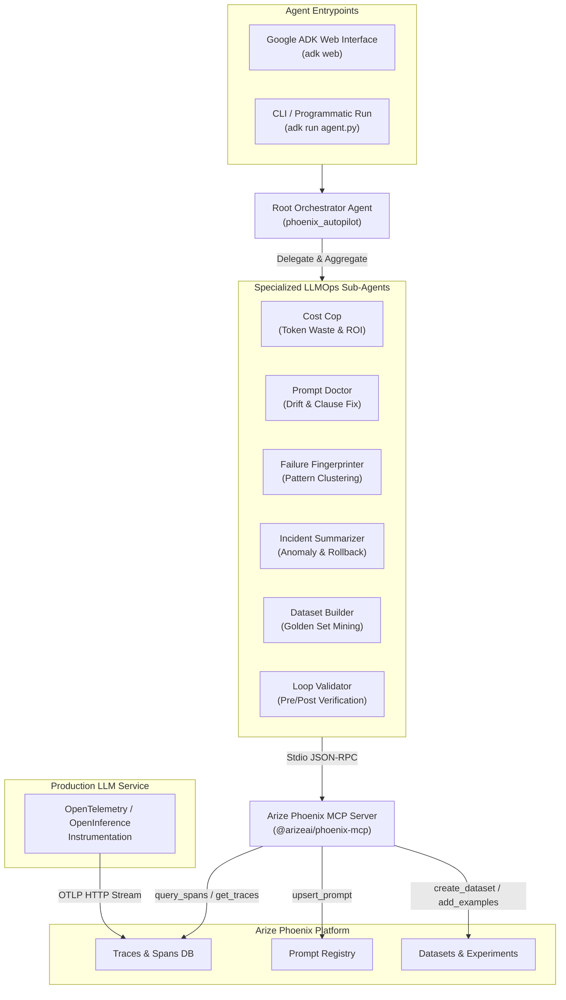

# Arize Phoenix Autopilot

[](https://github.com/RichardLitt/standard-readme)
[](#license)
[](requirements.txt)
[](https://phoenix.arize.com/)
[](https://github.com/google)

> An autonomous, 6-mode **LLMOps agent** powered by **Arize Phoenix MCP** and **Google ADK** — continuously monitoring production LLM telemetry, diagnosing token bloat and quality drift, and executing closed-loop prompt and dataset remediation.

Arize Phoenix Autopilot turns passive LLM observability into an **active, self-healing control loop**. Built on top of the **Google Agent Development Kit (ADK)** and integrated directly with **Arize Phoenix** via the **Model Context Protocol (MCP)**, Autopilot analyzes OpenTelemetry/OpenInference production spans to detect token inefficiencies, pinpoints prompt regressions down to individual broken prompt clauses, clusters recurring failure patterns, compiles incident reports, mines golden evaluation datasets, and verifies fix effectiveness before promoting changes.

It exposes the autonomous multi-agent architecture through **two execution modes**:

- **Mode A — Interactive Web UI (`adk web`).** A rich web interface powered by Google ADK where humans review diagnostic reports, inspect token cost projections, and confirm prompt modifications with a single click ("Review Mode").
- **Mode B — Autonomous CLI & Script Execution (`adk run agent.py`).** Programmatic CLI or background execution for automated, unattended LLMOps diagnostic pipelines ("Auto Mode").

---

## Architecture



**State lives natively in Arize Phoenix** — spans, evaluation scores (`eval.score`), prompt versions (`prompt.version`), and dataset registries — requiring no secondary database or proprietary storage for trace state.

---

## Table of Contents

- [Background](#background)
- [Install](#install)
- [Usage](#usage)
  - [Mode A — Interactive Web UI](#mode-a--interactive-web-ui)
  - [Mode B — Autonomous CLI & Script Execution](#mode-b--autonomous-cli--script-execution)
- [Environment & Configuration](#environment--configuration)
- [Diagnostic Sub-Agents](#diagnostic-sub-agents)
- [Demo & Trace Seeding](#demo--trace-seeding)
- [Repository Layout](#repository-layout)
- [License](#license)

---

## Background

Traditional LLM observability platforms (Arize Phoenix, LangSmith, Datadog) provide rich trace waterfalls and dashboards. However, when token costs spike or prompt evaluations drop, human engineers must manually:
1. Filter thousands of spans to calculate token input/output ratios.
2. Compare historical prompt versions line-by-line to identify bad instructions.
3. Cluster failing inputs to write regex guardrails or safety filters.
4. Manually curate regression test sets from production logs.
5. Push prompt updates back into a prompt registry and verify improvements.

**Phoenix Autopilot automates this entire lifecycle.** By coupling **Google ADK multi-agent orchestration** with **Arize Phoenix MCP tools**, Autopilot gives an LLM reasoning engine direct tool-access to telemetry storage. It acts as an autonomous site reliability engineer (SRE) for LLMs: analyzing traces, drafting optimized prompts, seeding golden datasets, and validating post-fix performance metrics.

---

## Install

### Prerequisites

- **Python**: `3.10+`
- **Node.js**: `18+` & `npx` (required to run the `@arizeai/phoenix-mcp` server)
- **Arize Phoenix Instance**: Cloud account or self-hosted instance (URL + API key)
- **Google Gemini API Key**: For agent reasoning (`gemini-2.0-flash`)

### Setup Instructions

1. **Clone the repository:**
   ```bash
   git clone https://github.com/786AdiPY/Arize.git
   cd Arize
   ```

2. **Create and activate a Python virtual environment:**
   ```bash
   python -m venv .venv
   source .venv/bin/activate
   ```

3. **Install Python dependencies:**
   ```bash
   pip install -r requirements.txt
   ```

4. **Configure environment variables:**
   Create a `.env` file in the root directory (or inside `phoenix_autopilot/`):
   ```ini
   PHOENIX_BASE_URL=https://app.phoenix.arize.com
   PHOENIX_API_KEY=your_phoenix_api_key_here
   PHOENIX_COLLECTOR_ENDPOINT=https://app.phoenix.arize.com/v1/traces
   GOOGLE_API_KEY=your_gemini_api_key_here
   ```

---

## Usage

### Mode A — Interactive Web UI

Launch the Google ADK web developer interface:

```bash
adk web
```

- Access the web interface at `http://localhost:8000` (or the URL displayed in your terminal).
- Select **`phoenix_autopilot`** from the agent dropdown.
- Run queries such as:
  - *"Run full diagnosis on phoenix-autopilot-demo"*
  - *"Check token cost waste"*
  - *"Diagnose prompt regression"*

In **Review Mode** (default), agents will propose actions (such as updating prompts in Phoenix) and await human confirmation before executing write operations (`upsert_prompt`, `create_dataset`).

### Mode B — Autonomous CLI & Script Execution

Run the agent framework directly via the ADK CLI:

```bash
adk run phoenix_autopilot/agent.py
```

To run in **Auto Mode** (bypassing interactive human confirmation prompts for full hands-off automation), include `"auto mode"` in your prompt:

```text
User: Run full diagnosis in auto mode
```

---

## Environment & Configuration

| Variable | Description | Required | Example / Default |
|---|---|---|---|
| `PHOENIX_BASE_URL` | Base URL of your Arize Phoenix instance | **Yes** | `https://app.phoenix.arize.com` |
| `PHOENIX_API_KEY` | Arize Phoenix API authorization key | **Yes** | `phx_api_key_...` |
| `PHOENIX_COLLECTOR_ENDPOINT` | OTLP HTTP trace collector endpoint | **Yes** | `https://app.phoenix.arize.com/v1/traces` |
| `GOOGLE_API_KEY` | Google Gemini API key for ADK LLM backbone | **Yes** | `AIzaSy...` |

---

## Diagnostic Sub-Agents

Phoenix Autopilot orchestrates 6 specialized sub-agents under a **Root Orchestrator** (`phoenix_autopilot`):

| # | Sub-Agent | Primary Purpose | Key Phoenix MCP Tools Used | Primary Target Metric / Action |
|---|---|---|---|---|
| **1** | **Cost Cop** (`cost_cop`) | Identifies token-wasteful query patterns and projects 30-day ROI | `list_projects`, `get_traces`, `search_spans`, `upsert_prompt` | High Input:Output Token Ratios (`llm.token_count`) |
| **2** | **Prompt Doctor** (`prompt_doctor`) | Pinpoints prompt version degradations and repairs broken instructions | `get_traces`, `upsert_prompt` | Evaluation Score drops (`eval.score`) |
| **3** | **Failure Fingerprint** (`failure_fingerprint`) | Clusters failing spans (`eval.score < 0.35`) into pattern buckets | `get_traces` | Systematic failure grouping & guardrails |
| **4** | **Incident Summarizer** (`incident_summarizer`) | Detects production anomaly windows and compiles incident reports | `get_traces` | Anomaly time window & rollback advice |
| **5** | **Dataset Builder** (`dataset_builder`) | Mines high/low quality production traces to construct golden test sets | `get_traces`, `create_dataset`, `add_examples` | Seeding `golden-eval-set-v1` dataset |
| **6** | **Loop Validator** (`loop_validator`) | Verifies post-fix score improvement before final production promotion | `get_traces` | Pre vs. Post fix score delta (`>= 15%`) |

---

### Agent Detail Breakdown

#### 1. Cost Cop (`cost_cop`)
- **Focus**: Detects queries consuming excessive context tokens relative to output tokens.
- **Cost Calculation**: Computes 30-day projected cost based on observation window and token pricing (e.g., Gemini 2.5 Flash rates: \$0.15/1M input, \$0.60/1M output).
- **Remediation**: Proposes prompt token reduction techniques and calls `upsert_prompt` upon consent.

#### 2. Prompt Doctor (`prompt_doctor`)
- **Focus**: Compares average evaluation scores across prompt versions (`v1.0.0` vs `v2.3.1`).
- **Remediation**: Identifies the exact clause added or removed that caused degradation, generates a surgical fix, and writes the updated template to Phoenix.

#### 3. Failure Fingerprint (`failure_fingerprint`)
- **Focus**: Filters spans where `eval.score < 0.35` and groups them by `query.type`.
- **Remediation**: Names specific failure patterns (e.g., *"Date-range queries fail under format MM/DD/YYYY"*) and suggests input validation guardrails.

#### 4. Incident Summarizer (`incident_summarizer`)
- **Focus**: Scans traces for clusters of triggered alerts (`alert.triggered = true`) or severe score drops (`eval.score < 0.25`).
- **Remediation**: Calculates incident window timestamps, affected session counts, and recommends immediate prompt rollback.

#### 5. Golden Dataset Builder (`dataset_builder`)
- **Focus**: Filters production traces into high-scoring (`eval.score > 0.85`) and low-scoring (`eval.score < 0.25`) benchmark sets.
- **Remediation**: Creates dataset `golden-eval-set-v1` via Phoenix MCP and populates labelled examples for CI/CD regression testing.

#### 6. Loop Validator (`loop_validator`)
- **Focus**: Evaluates candidate prompts (`autopilot-candidate`) against baseline metrics.
- **Remediation**: Enforces a minimum score delta (e.g., `+0.10` or `>=15%`). If insufficient, re-triggers **Prompt Doctor** to iterate on the fix.

---

## Demo & Trace Seeding

The repository includes a synthetic trace seeder ([`seed_traces.py`](seed_traces.py)) designed to populate an Arize Phoenix project named `phoenix-autopilot-demo` with realistic failure scenarios.

### Run the Seeder

```bash
python seed_traces.py
```

### Seeder Scenarios

| Scenario | Spans Generated | Target Sub-Agent | Simulated Anomaly |
|---|---|---|---|
| `healthy_baseline` | 20 spans | Baseline | High scores (`0.78 - 0.95`), standard tokens |
| `order_status_bloat` | 15 spans | **Cost Cop** | 2800–3400 input tokens for 40–80 output tokens |
| `bad_prompt_v2_3_1` | 15 spans | **Prompt Doctor** | Eval scores drop to `0.18 - 0.42` in `v2.3.1` |
| `date_range_failures` | 15 spans | **Failure Fingerprint** | `date_range_query` failure rate spike (`eval.score < 0.28`) |
| `incident_spike` | 10 spans | **Incident Summarizer** | Low score cluster (`0.05 - 0.25`) with `alert.triggered` |
| `golden_examples` | 15 spans | **Dataset Builder** | High scores (`0.88 - 0.98`) to mine for golden sets |

Once seeded, run **Phoenix Autopilot** to watch the agents autonomously analyze and fix these scenarios.

---

## Repository Layout

```
Arize/
├── phoenix_autopilot/         Google ADK Multi-Agent Package
│   ├── .env                   Environment configuration file
│   ├── __init__.py            Package initializer
│   └── agent.py               Root orchestrator & 6 diagnostic sub-agents
├── .adk/                      ADK session persistence database
├── LICENSE                    Apache 2.0 License file
├── README.md                  Project documentation (this file)
├── requirements.txt           Python dependency specification
└── seed_traces.py             Synthetic telemetry trace seeder for demos
```

---

## License

Distributed under the **Apache 2.0 License**. See [`LICENSE`](LICENSE) for details.
